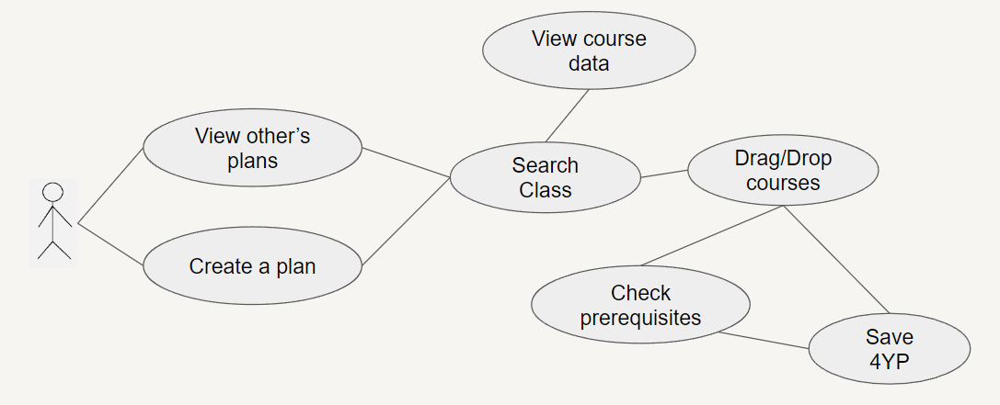
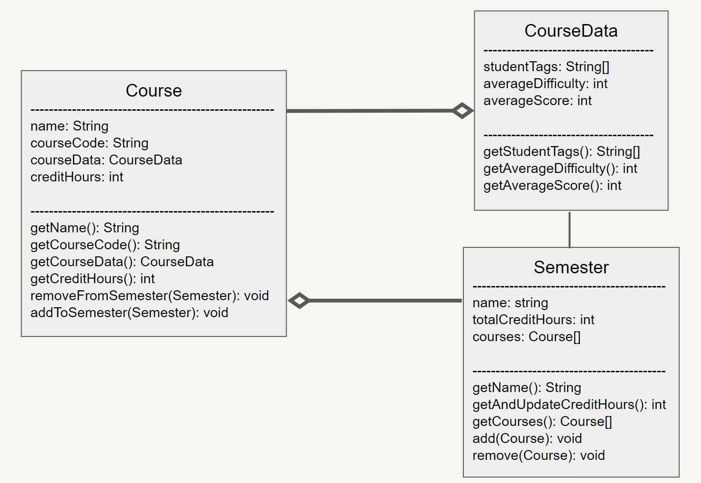
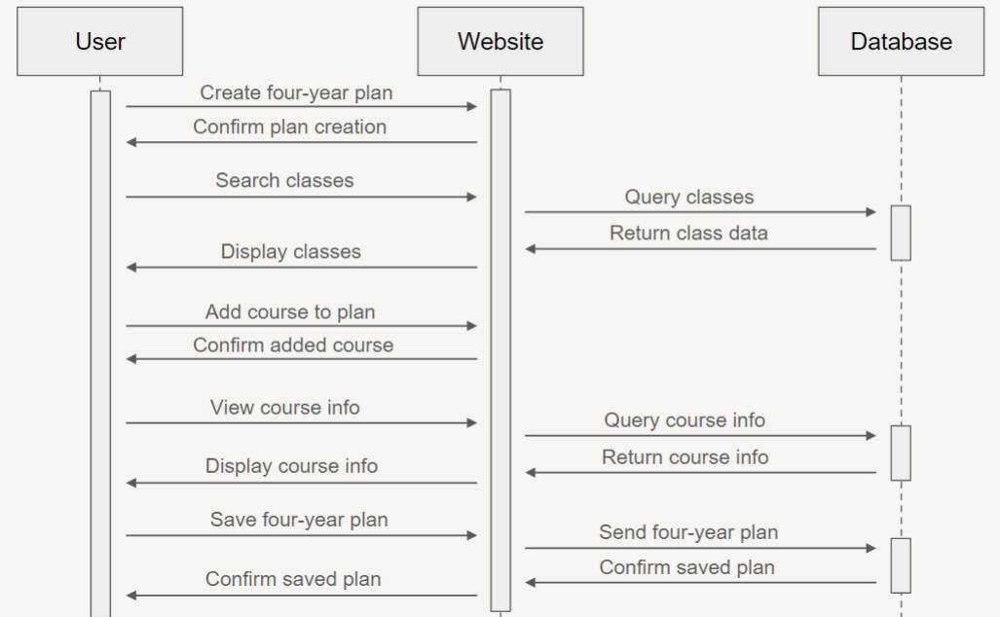

# DegreeWiz

## OSU 1282.04H FEH SI Project
DegreeWiz is a tool to help students create academic plans and discover classes.
This repository features a rudimentary prototype with the OSU class API.

## Prototype
A video of the prototype in practice is shown below.\
\
Alternatively, if you want to directly interact with the prototype then download the repository and run the `index.html` file.

## User Documentation
A Markdown document detailing how to use the application is shown in the `/doc` folder [here](./doc/User_Documentation.md).

## UML Diagrams
UML diagrams are shown in the `/doc/uml` folder, and are also shown below.

### Use Case Diagram:

### Class Diagram:

### Sequence Diagram:

### Figma Mockup:

https://www.figma.com/file/KefweSLmxGArNsIIRRb2tC/DegreeWiz?type=design&mode=design&t=OsJxfbQWIQ3lHCmF-1

## Marketing Materials
### Flyer

### Video

*Ryan Jung: jung.876@osu.edu*\
*Vihaan Vulpala: vulpala.1@osu.edu*\
*Samara Buchanan: buchanan.375@osu.edu*\
*Aidan Ackermann: ackermann.26@osu.edu*
